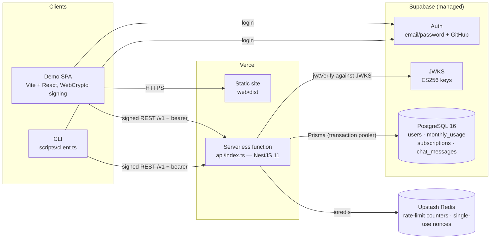

# GGI Backend — AI Chat & Subscription Bundles

A secure REST backend in TypeScript with DDD/Clean Architecture and PostgreSQL. It has two business modules:

1. **Chat.** An authenticated user asks a question and gets a mocked OpenAI answer. The system stores the question, answer, tokens and metadata, and enforces the free and bundle quotas.
2. **Subscriptions.** Users buy Basic, Pro or Enterprise bundles, monthly or yearly, with auto-renew. Renewal is simulated with random payment failures, and cancellation is supported.

Everything in this repository is traceable to the take-home PDF, `GGI - BACKEND TEST POSTURE (1) (1).pdf`, which is committed at the root. The approved design spec lives in `docs/superpowers/specs/2026-09-24-ggi-backend-design.md`; the task-by-task implementation plan is in `docs/superpowers/plans/2026-09-24-ggi-backend.md`.

## Live demo

The API and a minimal demo client are deployed on Vercel against a dedicated Supabase project and an
Upstash Redis:

- **Demo UI:** https://momin-imran-qureshi-demo.vercel.app
- **API:** https://momin-imran-qureshi-api.vercel.app
- **Sign in as admin:** email `demo@example.com`, password `Str0ng-Passw0rd!` (role `ADMIN` on the demo project).

These credentials are demo-only, for a throwaway project with simulated payment data — never reuse
this password anywhere. Sign in with them at the demo UI, or sign up with any address to see the clean
free-quota flow (auto-confirm is on). The admin account is what exposes `GET /v1/admin/metrics`,
`POST /v1/admin/billing/run` and the CLI (`npm run client -- metrics`). The deployed instance has
`BILLING_CRON` disabled, so renewals are triggered through the admin endpoint rather than a scheduler.
Deployment notes live in `docs/superpowers/specs/2026-09-24-vercel-deployment-design.md` (API) and
`docs/superpowers/specs/2026-09-24-demo-frontend-design.md` (UI).

## Overview

- Base `/v1`, JSON only.
- Every route needs **bearer token + request signature**, with two exceptions: `POST /v1/auth/device-keys` needs the bearer token only (it is the bootstrap step), and `/health` needs the probe token.
- List endpoints take `?limit=` (1–50, default 20) and return newest first.

There are **11 endpoints**:

| Method | Path                           | Roles               | Rate group    | Notes                                                                                                                                                                      |
| ------ | ------------------------------ | ------------------- | ------------- | -------------------------------------------------------------------------------------------------------------------------------------------------------------------------- |
| POST   | `/v1/auth/device-keys`         | any (bearer only)   | auth          | `{ publicKey: JWK }`: EC P-256 with only `kty,crv,x,y`. Creates the user row if missing. Errors: 409 `KEY_ALREADY_BOUND`, 403 `KEY_BINDING_WINDOW_CLOSED`                  |
| GET    | `/v1/auth/me`                  | USER, ADMIN         | auth          | `{ id, email, role }`                                                                                                                                                      |
| POST   | `/v1/chat/messages`            | USER, ADMIN         | chat          | `{ question: string 1..4000 }` → 201 `{ id, answer, model, usage, quota:{source, subscriptionId?, freeRemaining, freeResetsAt}, createdAt }`. Error: 402 `QUOTA_EXHAUSTED` |
| GET    | `/v1/chat/messages`            | USER, ADMIN         | chat          | Own history; admin may pass `?userId=`                                                                                                                                     |
| POST   | `/v1/subscriptions`            | USER, ADMIN         | subscriptions | `{ tier, billingCycle, autoRenew }` → 201, or 402 `PAYMENT_FAILED`                                                                                                         |
| GET    | `/v1/subscriptions`            | USER, ADMIN         | subscriptions | Own; admin may pass `?userId=`                                                                                                                                             |
| PATCH  | `/v1/subscriptions/:id`        | USER, ADMIN (owner) | subscriptions | `{ autoRenew }` only                                                                                                                                                       |
| POST   | `/v1/subscriptions/:id/cancel` | USER, ADMIN         | subscriptions | 409 `SUBSCRIPTION_NOT_ACTIVE`                                                                                                                                              |
| POST   | `/v1/admin/billing/run`        | **ADMIN**           | admin         | Runs a renewal cycle now                                                                                                                                                   |
| GET    | `/v1/admin/metrics`            | **ADMIN**           | admin         | `{ users, chat:{ messagesThisMonth, free, bundle, tokensThisMonth }, subscriptions:{ activeByTier, inactiveByReason } }`                                                   |
| GET    | `/health`                      | `X-Health-Token`    | ops           | DB `SELECT 1` + Redis `PING`                                                                                                                                               |

**Error envelope** (every non-2xx response):

```
{ "error": { "code": "QUOTA_EXHAUSTED", "message": "…", "details": { "freeUsed": 3, "freeLimit": 3, "freeResetsAt": "2026-10-01T00:00:00.000Z" }, "requestId": "…" } }
```

`ApiErrorCode` is an exported string-literal union:

| Status | Codes                                                                                                                                                 |
| ------ | ----------------------------------------------------------------------------------------------------------------------------------------------------- |
| 400    | `VALIDATION_FAILED` (issue paths, submitted values not echoed)                                                                                        |
| 401    | `UNAUTHENTICATED`, `INVALID_TOKEN`, `TOKEN_EXPIRED`, `SIGNATURE_REQUIRED`, `INVALID_SIGNATURE`, `KEY_NOT_BOUND`, `REQUEST_EXPIRED`, `REPLAY_DETECTED` |
| 402    | `QUOTA_EXHAUSTED`, `PAYMENT_FAILED`                                                                                                                   |
| 403    | `FORBIDDEN`, `KEY_BINDING_WINDOW_CLOSED`                                                                                                              |
| 404    | `NOT_FOUND`                                                                                                                                           |
| 409    | `KEY_ALREADY_BOUND`, `SUBSCRIPTION_NOT_ACTIVE`                                                                                                        |
| 413    | `PAYLOAD_TOO_LARGE`                                                                                                                                   |
| 415    | `UNSUPPORTED_MEDIA_TYPE`                                                                                                                              |
| 429    | `RATE_LIMITED` (+ `Retry-After`)                                                                                                                      |
| 503    | `SERVICE_UNAVAILABLE`                                                                                                                                 |
| 504    | `REQUEST_TIMEOUT`                                                                                                                                     |
| 500    | `INTERNAL_ERROR`                                                                                                                                      |

Domain errors carry a `code`, and one global exception filter maps them to HTTP responses.

## Architecture decisions

### System architecture



The same Nest application runs in both shapes: locally as a normal server (`npm run start:dev`,
Postgres and Redis from `compose.yaml`), and on Vercel as one serverless function wrapped by
`api/index.ts`. Vercel's body helpers are disabled there so the raw request body reaches the app's
JSON parser and request signatures can be verified. The sections below describe the internals.

### Layers and rules

```
controllers/ → application/ (use cases) → domain/{entities,services,policies}
                     ↓ interfaces
               repositories/ (interface + Prisma implementation)
               infrastructure/ (AI mock, payment simulator, scheduler)
```

- `domain/**` must not import `@nestjs/*`, `@prisma/*`, `express` or `ioredis`. This is enforced with ESLint `no-restricted-imports` overrides; no extra plugin is needed.
- Use cases depend on repository **interfaces** and ports only.
- Controllers only validate input, build the `Actor`, call a use case and map the result.

### Module layout

```
src/
  main.ts                    # bootstrap: server timeouts, body limit, helmet, CORS
  app.module.ts
  config/env.ts              # Zod env schema; fail fast
  shared/
    domain/                  # DomainError, Actor, Clock
    prisma/                  # PrismaService, TransactionRunner (ALS tx client)
    redis/                   # RedisService, RateLimiter
    http/                    # guards, exception filter, timeout interceptor, zod pipe,
                             # content-type + request-id middleware, decorators
  auth/
    domain/{entities,services,policies}/  # DeviceBinding, SignatureVerifier, KeyBindingPolicy
    application/             # RegisterDeviceKey, GetMe
    repositories/            # user + device-binding repos
    infrastructure/          # SupabaseTokenVerifier (jose), NonceStore (redis)
    controllers/
  chat/
    domain/entities/         # ChatMessage, MonthlyUsage
    domain/services/         # QuotaAllocator, UsagePeriod, TokenEstimator
    domain/policies/         # ChatAccessPolicy, BundleSelectionPolicy
    domain/ports.ts          # AiCompletionPort, BundleQuotaPort
    application/             # AskQuestion, ListChats
    repositories/
    infrastructure/          # MockOpenAiAdapter
    controllers/
  subscriptions/
    domain/entities/         # Subscription
    domain/services/         # PricingCatalog, PeriodCalculator
    domain/policies/         # SubscriptionAccessPolicy
    domain/ports.ts          # PaymentGatewayPort
    application/             # Create, Cancel, SetAutoRenew, List, RunBillingCycle
    repositories/
    infrastructure/          # SimulatedPaymentGateway, BillingScheduler, BundleQuotaAdapter
    controllers/
  observability/             # HealthController, MetricsController
prisma/schema.prisma, prisma/migrations/
scripts/client.ts            # login (email/pw) → register key → signed requests
scripts/promote-admin.ts     # set role=ADMIN by email
test/unit/, test/integration/, test/support/ (mock-idp, signer, app factory)
compose.yaml                 # postgres + redis
```

### Why these choices

| #   | Decision                     | Choice                                                                                                                                                                       |
| --- | ---------------------------- | ---------------------------------------------------------------------------------------------------------------------------------------------------------------------------- |
| D1  | Framework                    | TypeScript (strict) + **NestJS** (Express adapter)                                                                                                                           |
| D2  | ORM / migrations             | **Prisma** + PostgreSQL 16                                                                                                                                                   |
| D3  | Identity provider            | **Supabase Auth** (email/password + GitHub OAuth, both configured in the Supabase dashboard), verified via JWKS                                                              |
| D4  | "Token alone is not enough"  | **Session-bound request signing** (ECDSA P-256 key bound to the Supabase `session_id`; signed timestamp + nonce + body hash)                                                 |
| D5  | Rate-limit and nonce storage | **Redis 7**                                                                                                                                                                  |
| D6  | Quota deduction              | **Row lock (`SELECT … FOR UPDATE`) + a pure domain allocator, in one transaction after the AI call** (§8.3)                                                                  |
| D7  | Validation                   | **Zod** `.strict()` schemas through one Nest pipe                                                                                                                            |
| D8  | Logging                      | **pino** through a small request-completion middleware (no `nestjs-pino`)                                                                                                    |
| D9  | Scheduler                    | `@nestjs/schedule` cron + `FOR UPDATE SKIP LOCKED`                                                                                                                           |
| D10 | Rate limiter                 | Small custom Redis fixed-window limiter (`INCR` + `EXPIRE`) used by two guards                                                                                               |
| D11 | Tests                        | Jest + supertest. Integration tests run against Postgres and Redis started by `compose.yaml` (Podman locally, service containers in CI). The IdP is a local mock JWKS server |
| D12 | Runtime                      | **Node 22 LTS**                                                                                                                                                              |
| D13 | Health endpoint              | Protected by the `X-Health-Token` header                                                                                                                                     |

- **NestJS** provides the module boundaries, dependency injection and guard/interceptor pipeline that make the Clean Architecture layering enforceable without hand-rolling a framework.
- **Prisma** gives typed queries, typed migrations and a first-class transaction client; `$queryRaw` with tagged templates keeps the row locks parameterized.
- **Supabase Auth** supplies an external OIDC provider (email/password and GitHub OAuth) with asymmetric JWTs, so the app never handles passwords and only needs a JWKS endpoint to verify tokens.
- **Redis** stores the single-use request nonces and the fixed-window rate-limit counters, both of which must be shared state with a TTL.

### The chat → subscriptions contract

Chat defines the port and subscriptions implements it (`BundleQuotaAdapter`), so chat never imports subscription entities:

```
interface BundleQuotaPort {
  lockUsableBundles(userId: string, now: Date): Promise<BundleSnapshot[]>; // FOR UPDATE, ORDER BY id
  consume(subscriptionId: string): Promise<void>;
}
type BundleSnapshot = { id: string; remaining: number | null; createdAt: Date; startDate: Date; endDate: Date };
```

### Transactions

`TransactionRunner.run(fn)` wraps `prisma.$transaction` (ReadCommitted, 5s timeout) and stores the transaction client in `AsyncLocalStorage`. Repositories use that client when one exists, so the chat and subscription repos join the same transaction. Row locks use `$queryRaw` with the `Prisma.sql` tagged template, which is parameterized. `*Unsafe` raw queries are banned by an ESLint rule.

### The quota flow

```
AskQuestion(actor, question):
  1. Pre-check (no lock): if the user has neither free quota nor a usable bundle → 402 QUOTA_EXHAUSTED  (don't pay for an AI call)
  2. answer = AiCompletionPort.complete(question)          ← mock, random 300–1500ms latency, outside any transaction
  3. Tx (authoritative):
       INSERT monthly_usage … ON CONFLICT DO NOTHING
       SELECT monthly_usage … FOR UPDATE                    ← serialises this user's requests
       bundles = BundleQuotaPort.lockUsableBundles(user)    ← FOR UPDATE, ORDER BY id (fixed lock order)
       allocation = QuotaAllocator.allocate(...)            ← pure domain; throws QuotaExhausted if a race was lost
       consumeFree() | consume(bundle) + recordBundleUse()
       INSERT chat_messages (question, answer, tokens, requestId, source, …)
     commit → 201
```

- **Atomic and concurrency-safe:** quota is only deducted inside the locked transaction, and the CHECK constraints guard it a second time. N parallel requests with 3 free messages left produce exactly 3 × 201.
- **Why this order:** nothing is reserved before the AI call, so there's no PENDING state, no refund path and no clean-up job. The cost is that a request which loses a race wastes one mock AI call, which is acceptable.
- **Timeouts:** if the request has already timed out (504 sent) when the AI call returns, the use case skips the transaction, so the user is never charged for an answer they didn't receive.

The concurrency claim is proven by an integration test: `test/integration/chat/chat-api.int-spec.ts` fires **10 parallel requests with 3 free messages left and expects exactly 3 × 201**.

### Mock OpenAI

- Waits a random delay between `AI_MOCK_MIN_LATENCY_MS` and `AI_MOCK_MAX_LATENCY_MS`.
- Returns an OpenAI-shaped result (`id`, `model: 'gpt-4o-mini'`, `choices[0].message.content`, `usage`).
- The content is a canned answer chosen by hashing the question, and it is sanitized before storage.

### Billing cycle

A cron job (`BILLING_CRON`, every minute) and `POST /v1/admin/billing/run` both call `RunBillingCycle`:

```
Tx: SELECT subscriptions WHERE status='ACTIVE' AND renewal_date <= now
    ORDER BY renewal_date FOR UPDATE SKIP LOCKED LIMIT 50
    for each: paymentOk = autoRenew ? gateway.charge(...) : undefined
              sub.renew(now, paymentOk); save
```

The result of each payment is logged. Each run advances one cycle.

### Interpretations of ambiguous requirements

| #   | PDF text                                    | Interpretation                                                                                                                                            |
| --- | ------------------------------------------- | --------------------------------------------------------------------------------------------------------------------------------------------------------- |
| A1  | "bundle with the latest remaining quota"    | Free quota first, then the **most recently created** usable bundle (`createdAt DESC, id DESC`). Enterprise (unlimited) always has quota remaining.        |
| A2  | 3 free per calendar month, reset on the 1st | UTC month. A row per `(user, 'YYYY-MM')`, so the reset is implicit and needs no cron job.                                                                 |
| A3  | Basic 10 / Pro 100                          | `maxMessages` **per billing cycle**; renewal resets `usedMessages`.                                                                                       |
| A4  | Cancellation ends the current cycle         | Takes effect immediately: `endDate = now`, `INACTIVE (CANCELLED)`, `autoRenew = false`, `renewalDate = null`. Chat history is kept.                       |
| A5  | active / inactive                           | `status ∈ {ACTIVE, INACTIVE}` + `inactiveReason ∈ {CANCELLED, PAYMENT_FAILED, EXPIRED}`.                                                                  |
| A6  | Payment at creation                         | The first cycle is charged on creation. If that fails, the subscription is saved as `INACTIVE (PAYMENT_FAILED)` and the API returns 402 `PAYMENT_FAILED`. |
| A7  | "Authentication endpoints"                  | Our auth routes are `POST /v1/auth/device-keys` and `GET /v1/auth/me`, and they get the strictest limits.                                                 |
| A8  | All endpoints protected                     | Health needs `X-Health-Token`. Metrics is admin-only.                                                                                                     |
| A9  | Admin system-wide access                    | Admins can list any user's chats and subscriptions (via `?userId=`), cancel any subscription, view metrics and trigger billing.                           |

## Security model

| Requirement                                           | Mechanism                                                                                          |
| ----------------------------------------------------- | -------------------------------------------------------------------------------------------------- |
| External OIDC, email/password + OAuth, no custom auth | Supabase Auth; the app never handles passwords                                                     |
| Server-side verification (iss/aud/exp)                | `jose` + remote JWKS, pinned algorithms                                                            |
| Token alone not sufficient                            | Session-bound request signing + timestamp + single-use nonce                                       |
| RBAC, controller level                                | `RolesGuard` + `@Roles`                                                                            |
| RBAC, domain level                                    | `ChatAccessPolicy`, `SubscriptionAccessPolicy`, `KeyBindingPolicy` inside use cases                |
| Headers / CORS / size / content type / timeout        | §8.1                                                                                               |
| Rate limits (per minute, env-overridable)             | auth 20/IP, 10/user · chat 60/IP, 20/user · subscriptions 60/IP, 30/user · admin 60/60 · ops 30/IP |
| Schema validation, unknown fields rejected            | Zod `.strict()` on body and query; UUID params validated                                           |
| XSS                                                   | JSON-only API, CSP `default-src 'none'`, nosniff; free text stripped of HTML before storage        |
| Injection                                             | Prisma parameterized queries; ESLint bans `$queryRawUnsafe`/`$executeRawUnsafe`                    |
| Mass assignment                                       | Explicit DTO-to-command mapping; `userId` always from `Actor`; PATCH accepts only `autoRenew`      |
| Config                                                | Zod-validated env; the app refuses to boot if config is invalid; `.env.example` only               |

### Request signing

**Client** (`scripts/client.ts` and the test signer):

1. Log in to Supabase with `supabase-js`.
2. Generate a P-256 key pair.
3. Call `POST /v1/auth/device-keys`.
4. Sign each request with these headers:
   - `X-Signature-Timestamp` (unix seconds)
   - `X-Signature-Nonce` (base64url, ≥128 bits)
   - `X-Signature` (base64url ECDSA P-256/SHA-256, IEEE-P1363) over:

```
GGI-SIG-V1\n{METHOD}\n{originalUrl}\n{timestamp}\n{nonce}\n{base64url sha256(rawBody)}\n{base64url sha256(accessToken)}
```

**Server checks, in order:**

1. Bearer token present.
2. `jose.jwtVerify` with the remote JWKS:
   - `iss = ${SUPABASE_URL}/auth/v1`, `aud = authenticated`, algorithms `ES256`/`RS256`, 5s clock tolerance;
   - `sub`, `exp` and `session_id` required; `is_anonymous !== true`.
3. Signature headers present.
4. `|now − ts| ≤ 60s`.
5. Load the binding by `session_id` and check that `user_id = sub`.
6. Verify the signature.
7. Redis `SET nonce:{sessionId}:{nonce} NX EX 120`; if it already exists, the request is a replay.
8. Attach `Actor { userId, role, sessionId }` to the request.

Redis errors make the request fail closed with 503.

### Request pipeline and guard order

```
Node server (requestTimeout, headersTimeout)
 → request-id middleware (accept X-Request-Id only if it is a UUID, else generate; echo in response)
 → pino-http (reqId, userId once known, responseTime)
 → helmet (CSP default-src 'none', HSTS, nosniff, frame-ancestors none, no-referrer) + Cache-Control: no-store
 → CORS (CORS_ORIGINS allowlist, no credentials)
 → content-type check (POST/PATCH must be application/json → 415)
 → JSON parser (16kb limit → 413; raw body kept for signing)
 → global guards, in order:
     IpRateLimitGuard → AuthGuard (default deny) → UserRateLimitGuard → RolesGuard (@Roles)
 → TimeoutInterceptor (REQUEST_TIMEOUT_MS=10s → 504)
 → ZodValidationPipe (.strict(), trims strings, strips HTML from free text via sanitize-html)
 → controller → use case (domain policy check) → domain
 → GlobalExceptionFilter
```

`AuthGuard` is global and denies by default. The only non-signature routes are the ones marked `@BearerOnly()` (key registration) or `@HealthProbe()`. An integration test calls every route without credentials and expects 401.

### Rate limits

Fixed window of 60 seconds per group (`src/shared/redis/rate-limit.config.ts`):

| Group         | Per IP / minute | Per user / minute |
| ------------- | --------------- | ----------------- |
| auth          | 20              | 10                |
| chat          | 60              | 20                |
| subscriptions | 60              | 30                |
| admin         | 60              | 60                |
| ops           | 30              | 30                |

The counter is a Redis `INCR` + `EXPIRE` pair inside one Lua script (`src/shared/redis/rate-limiter.ts`). The limits are compile-time constants; note that the spec's §9 wording calls them "env-overridable", which this minimal build does not implement.

### Residual risks

- **Trust on first use when binding a key.** A token stolen within 5 minutes of login, before the client binds its key, could be bound by an attacker. The real client then gets `KEY_ALREADY_BOUND`, which can be detected. DPoP-capable IdPs would close this gap.
- **Signatures cover `originalUrl`.** A proxy must not rewrite paths.

## Setup

### Prerequisites

- **Node 22 LTS** (`engines` requires `>=22`).
- **PostgreSQL 16 and Redis 7**, easiest through Docker or Podman. With Podman and no `docker compose` shim, install `podman-compose` and prefix commands with `COMPOSE=podman-compose`.
- A **Supabase project** for real login. The test suite does not need one (see Testing).

### Local setup

```bash
cp .env.example .env    # fill in SUPABASE_URL, SUPABASE_ANON_KEY and HEALTH_CHECK_TOKEN
npm ci
npm run db:up           # or: COMPOSE=podman-compose npm run db:up
npm run db:migrate      # prisma migrate deploy
npm run start:dev       # nest start --watch on http://localhost:3000
```

`compose.yaml` starts Postgres (user/password/database `ggi`, plus the `ggi_test` database created by `docker/postgres-init.sql`) and Redis on their default ports. `DATABASE_URL`, `REDIS_URL`, `CORS_ORIGINS`, `TRUST_PROXY`, timeouts, mock-AI latency bounds, `PAYMENT_FAILURE_RATE`, `BILLING_CRON`, `HEALTH_CHECK_TOKEN` and `LOG_LEVEL` are all read through `src/config/env.ts`, which refuses to boot on invalid config. `.env` is git-ignored; never commit real secrets.

Smoke-check the running app:

```bash
curl -s localhost:3000/health -H "X-Health-Token: $HEALTH_CHECK_TOKEN"
```

### Supabase setup

1. **Create a project.** Use the [Supabase dashboard](https://supabase.com/dashboard) or `supabase projects create <name> --org-id <org-id> --db-password <password> --region <region>`. Note the project ref and, with `supabase projects api-keys --project-ref <ref>`, the anon key.
2. **Check that asymmetric JWT signing keys are active.** `curl -s https://<ref>.supabase.co/auth/v1/.well-known/jwks.json` must return a non-empty `keys` array (ES256 or RS256). If `keys` is empty, the project still uses the legacy HS256 shared secret; open **Dashboard → Project Settings → JWT Keys** and migrate to (and rotate onto) asymmetric signing keys, then re-check. The app verifies tokens against this JWKS, so signatures cannot work without it.
3. **Configure auth.** In **Dashboard → Authentication → Providers**, enable email/password and GitHub. For GitHub, create an OAuth app at <https://github.com/settings/applications/new> with homepage `https://<ref>.supabase.co` and callback `https://<ref>.supabase.co/auth/v1/callback`, then paste the client ID and secret into the provider settings. For a demo, enable auto-confirm so signup works without email confirmation.
4. **Fill in `.env`.** Set `SUPABASE_URL=https://<ref>.supabase.co`, `SUPABASE_ANON_KEY=<anon key>` (used only by the CLI client) and `HEALTH_CHECK_TOKEN=$(openssl rand -hex 24)`.

### CLI client

`scripts/client.ts` is the manual end-to-end client. It logs in with `supabase-js`, generates a P-256 key pair, binds the public key through `POST /v1/auth/device-keys`, stores the access token and private key in `.ggi-session.json` (mode 0600, git-ignored), and signs every later request.

```bash
npm run client -- signup <email> <password>
npm run client -- login <email> <password>          # binds a key and saves the session
npm run client -- login-token <jwt>                 # or reuse a token from any login flow (e.g. GitHub OAuth)
npm run client -- me
npm run client -- ask "What is a golden gate?"
npm run client -- chats
npm run client -- subscribe BASIC MONTHLY true      # tier: BASIC|PRO|ENTERPRISE, cycle: MONTHLY|YEARLY
npm run client -- subs
npm run client -- auto-renew <subscription-id> false
npm run client -- cancel <subscription-id>
npm run client -- metrics                           # requires an admin
npm run client -- billing-run                       # requires an admin
```

The CLI reads `SUPABASE_URL`, `SUPABASE_ANON_KEY` and `API_BASE_URL` from `.env`.

### Promoting an admin

Bind a key once so the user row exists, then:

```bash
npm run promote-admin -- <email>
```

## Testing

```bash
npm run db:up      # Postgres + Redis must be running
npm run test:unit  # pure domain, no I/O
npm run test:int   # supertest against real Postgres and Redis
```

The full gate is `npm run format:check && npm run lint && npm run typecheck && npm test && npm run build`; the same sequence (minus the build) runs in GitHub Actions on every push and pull request.

The IdP is **mocked with a real JWKS server, not bypassed**: `test/support/mock-idp.ts` serves a JWKS for a generated ES256 key and mints Supabase-shaped tokens, and the app's real verifier fetches from it. No external accounts are needed.

**Unit** (pure domain, no I/O):

- `QuotaAllocator` and `UsagePeriod`:
  - free first;
  - free exhausted → latest bundle;
  - exhausted, expired and inactive bundles skipped;
  - unlimited bundle;
  - none → typed error;
  - UTC month boundary.
- `Subscription` lifecycle: create OK/failed, consume to the limit, set auto-renew, cancel, renew success/failure/expire, month-end clamping.
- Policies and `SignatureVerifier` (tampered fields are rejected).

**Integration** (supertest + real Postgres/Redis from `compose.yaml`):

- **Mock IdP, not bypassed:** a local HTTP server serves a JWKS for a generated ES256 key and mints Supabase-shaped tokens. The app's real verifier fetches from it.
- **Authenticated access:**
  - no token, wrong issuer, wrong audience, expired, `alg:none` → 401;
  - no binding → `KEY_NOT_BOUND`;
  - bad signature → 401; replayed nonce → 401;
  - happy path → 2xx;
  - every route without credentials → 401;
  - user on admin route → 403; user A listing user B's chats → 403 or 404.
- **Quota:** 3 free then 402; **10 parallel requests with 3 free left → exactly 3 × 201**; bundle used after the free quota.
- **Rate limiting:** per-user chat limit → 429 with `Retry-After`; per-IP auth limit → 429.
- **Security middleware:** helmet headers; disallowed CORS origin; 413; 415; unknown field → 400; timeout → 504; error envelope shape.

The `overrides: { "htmlparser2": "10.1.0" }` pin in `package.json` exists because Jest 29's CJS runtime cannot `require` the ESM-only `htmlparser2@12` that `sanitize-html@2.17.7` depends on; revisit the pin when the test runtime supports ESM-only dependencies.

## Future work

Cut from this minimal build, in the spec's priority order:

- OAuth PKCE CLI script. GitHub login is configured in Supabase, and `scripts/client.ts` accepts a token from any login flow via `npm run client -- login-token <jwt>` (an intentional deviation from the spec's `--token` flag).
- Reserve/complete flow with PENDING status, refunds and a sweeper, replaced by the flow in §8.3.
- Billing-events table. Payment results are logged instead.
- Logout/revoke-key endpoint, binding expiry, route audit at boot (covered by the test instead), boundaries plugin, Testcontainers.
- GET-by-id endpoints, the plans endpoint, the usage endpoint and separate admin list controllers.
- Dockerfile for the API. `compose.yaml` runs only Postgres and Redis, and the app runs with `npm run start:dev`.
- OpenAPI docs and Prometheus metrics.
